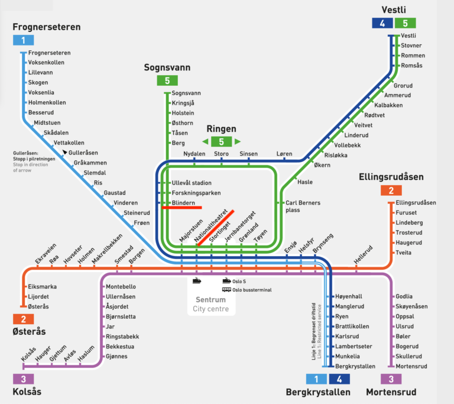

# Pratical information

## Accommodation:
The accommodation of the participants is the Scandic Victoria Hotel, Rosenkrantzgate 13, 0121 Oslo, Norway. The hotel is located in the city center of Oslo, close to the National Theatre. The National Theatre station is a train station well connected to the airport, and a metro station too, which connects to the University where the venue is located.

  
  

    Photo credit: Tripadvisor
  

<iframe src="https://www.google.com/maps/embed?pb=!1m18!1m12!1m3!1d2000.1811813699874!2d10.73434347774496!3d59.91254037490197!2m3!1f0!2f0!3f0!3m2!1i1024!2i768!4f13.1!3m3!1m2!1s0x46416e87820ed083%3A0xa9af7b88b9a6ff76!2sScandic%20Victoria!5e0!3m2!1sen!2sno!4v1725658228311!5m2!1sen!2sno" width="600" height="450" style="border:0;" allowfullscreen"></iframe>

## Venue:
The Deep Learning workshop will be held at the 
Institute of Theoretical Astrophysics (ITA), University of Oslo, Norway.

  
  

    Photo credit: University of Oslo
  

<iframe src="https://www.google.com/maps/embed?pb=!1m18!1m12!1m3!1d1998.6049576856876!2d10.7157174020996!3d59.93869706167309!2m3!1f0!2f0!3f0!3m2!1i1024!2i768!4f13.1!3m3!1m2!1s0x46416de78d5b8f73%3A0x599b474329d7c3f3!2sInstitute%20of%20Theoretical%20Astrophysics!5e0!3m2!1sen!2sno!4v1725657988280!5m2!1sen!2sno" width="600" height="450" style="border:0;" allowfullscreen></iframe>

## Transportation:

### General information:
The public transportation system in Oslo is very efficient and well-connected. The main means of transportation are the metro, the tram, the bus, and the train. It also includes ferries and boats that connect the city with the islands in the fjord (in case you want to visit them). The metro is the most used means of transportation in the city and it is the easiest way to get around. Download the Ruter (https://ruter.no/) app to your phone from the app store to buy the tickets. You will have to use a debit/credit card to pay for the tickets. The tickets are valid for all means of transportation in the city. For most of you the "7-day ticket" is the best option. The hotel and the venue are inside "Zone 1", so please choose the "Zone 1" option when buying the tickets.

### From the airport to the hotel:
The easiest way to get from the airport to the hotel is by train. The train station is located in the airport and the train takes you to the National Theatre station, which is located close to the hotel. The train ride takes around 45 minutes. Use the Ruter app to check the timetable and the next train. Google Maps also works but the timing is not as accurate. Usually regional trains with the tag "RE10", "RE11" or "R12" are doing this route. To buy a ticket from the Ruter app, you will have to add "Zone 1 to 4N" to your ticket. The train station is located in the airport, just follow the signs. Same idea for the return trip.

**Important note**: If your flight arrives late at night, regional trains might not be available. There is another option which is the "Flytoget" train. This train is more expensive but it runs until 00:50. If you arrive after this time, there is a bus service called "Flybussen" that runs even later. The bus stop is located outside the airport, just follow the signs. The bus takes you to the city center and you can take a taxi from there to the hotel. In any case, please share your flight details with us so we can help you with the transportation.

### From the hotel to the venue:
The easiest way to get from the hotel to the venue is by metro. The metro station is located close to the hotel and the venue is located on the campus at the metro stop called Blindern. The metro ride takes around 15 minutes. Look for the sign "T-bane" to find the metro station. If you buy single tickets, remember to choose the "Zone 1" option. Take lines 4 or 5 in the direction of "Vestli" or "Sognsvann" and get off at the stop called "Blindern".

